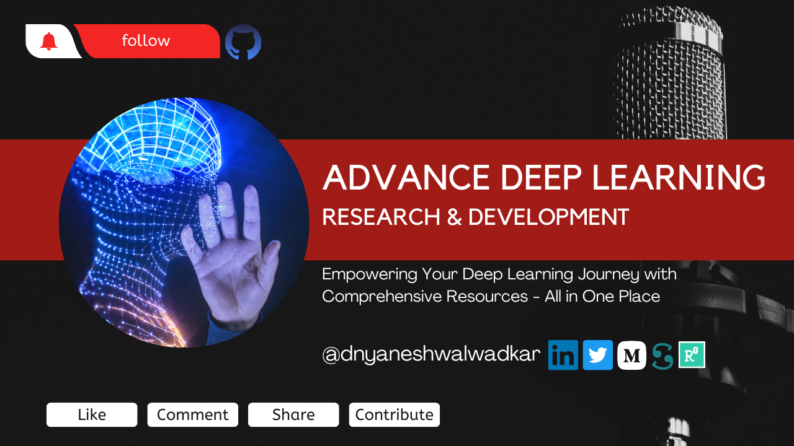

# Title: Advanced Deep Learning

## Description:

🚀 Greetings and welcome to the # Advanced Deep Learning repository! We are a team of passionate researchers and experts from diverse academic backgrounds, driven by the desire to explore the latest advancements, cutting-edge techniques, and innovative applications in the dynamic field of deep learning.

Our repository is dedicated to advancing the frontiers of deep learning by providing an all-encompassing resource that caters to the needs of students, researchers, and enthusiasts alike. We strive to maintain the highest standards of quality and accessibility to ensure that our repository remains a go-to source of knowledge and inspiration for anyone who seeks to push the boundaries of this fascinating field.

Join us on our journey of discovery and innovation as we unravel the mysteries of deep learning and shape the future of artificial intelligence.

### 📚 What's Inside?

This repository covers a wide range of advanced deep learning topics, including but not limited to:

### State-of-the-art deep learning architectures
### Generative Adversarial Networks (GANs)
### Reinforcement learning and inverse reinforcement learning
### Meta-learning and few-shot learning
### Object detection and segmentation
### Natural Language Processing (NLP)
### Uncertainty quantification and Bayesian deep learning
### Adversarial training and robust loss functions
### Custom loss function design and optimization
### Model evaluation, hyperparameter tuning, and cross-validation strategies
### 🔬 Research Papers

In addition to our commitment to advancing the frontiers of deep learning, we also take pride in offering an extensive collection of research paper implementations. Our team is dedicated to staying up-to-date with the latest breakthroughs and developments in the deep learning community, and we work tirelessly to ensure that our repository is a go-to source for the latest research.

We understand the importance of clear, well-documented code and thorough explanations in ensuring that our users can easily understand and apply these cutting-edge techniques in their own projects. That's why we take great care to ensure that our implementations are meticulously crafted, with detailed explanations and code annotations to guide you through the process.

So whether you're a seasoned researcher or a curious enthusiast, our repository is here to help you stay at the forefront of the deep learning revolution. Join us today and discover the limitless potential of this rapidly evolving field.

### 💡 Get Involved

We encourage you to contribute to this repository by sharing your own implementations, adding new research papers, or suggesting improvements to existing content. Together, we can create a vibrant and dynamic learning environment that fosters growth, collaboration, and innovation in the world of deep learning.

### 🌐 Stay Connected

Don't forget to *star* and *watch* this repository to stay informed about new additions and updates. Join our community of deep learning enthusiasts and embark on an exciting journey of discovery, exploration, and innovation!
Repository Link : 
)
🔍 Keywords: #DeepLearning, #ResearchPapers, #AdvancedTechniques, #NeuralNetworks, #GANs, #ReinforcementLearning, #MetaLearning, #ObjectDetection, #NaturalLanguageProcessing, #ComputerVision, #UncertaintyQuantification, #AdversarialTraining, #DeepLearningArchitectures
